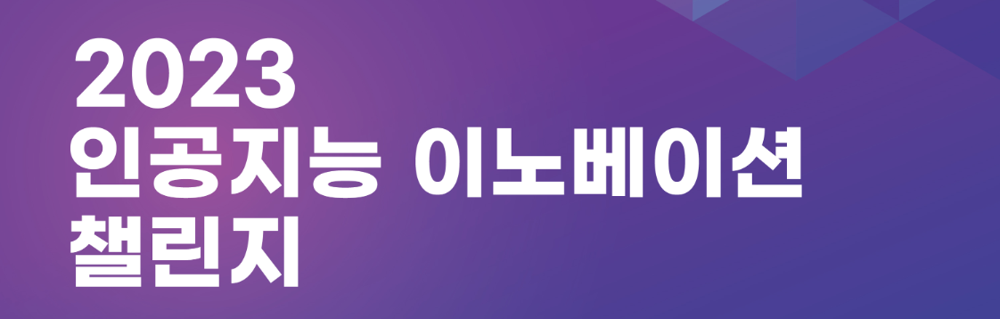

# 2023 SW중심대학 공동 AI 경진대회

- 과학기술정보통신부 주관 2023 SW 중심대학 공동 AI 경진대회로, [위성 이미지 건물 영역 분할] 주제에 대해 제공받은 위성 데이터를 기반으로 진행하였다.
- 결과: 최종순위 4위, 공동 3등

- 개요
  - 주제: 위성 이미지 건물 영역 분할(Satellite Image Building Area Segmentation)
  - 기간: 2023.7.3 ~ 2023.8.14
  - 방식: 팀프로젝트
  - Task: 의미론적 분할(Semantic Segmentation)

> Presentation: [2023_dacon.pdf](./2023_dacon.pdf)

## Team Member

|  Name  | Organization |
| :----: | :----------: |
| 권승찬 |    SSU AI    |
| 이정윤 |    SSU AI    |
| 김도언 |    SSU AI    |
| 임규일 |    SSU AI    |
| 이민우 |    SSU AI    |

## Environment

- Ubuntu 22.04.2 LTS
- CUDA Version: 12.0
- RTX 3090 x 1
- python 3.11.4

## Install

```
conda create -n segment python=3.11.4 -y
conda activate segment
pip install -r requirements.txt
```

monai, segmentation_models_pytorch, transformers, tensorboard

## Data

### Move

- train2.csv, test.csv, sample_submission.csv
- train_img
- test_img

**=> data 디렉토리로 이동**

### Divide

- stride = 256
- size = 512

```
cd data
python data.py
```

**=> data/data_512 생성**

### OBA(Object-Based Augmentation)

약 25분 소요(Divide랑 같이 실행 추천)

data/oba.ipynb  
전부 실행

[paper](https://openaccess.thecvf.com/content/ICCV2021W/ILDAV/papers/Illarionova_Object-Based_Augmentation_for_Building_Semantic_Segmentation_Ventura_and_Santa_Rosa_ICCVW_2021_paper.pdf)

**=> data/oba/result2 생성**

## Train

```
python train_smp_one.py --config train_smp_512.yaml
```

## Inference

config/predict_smp_512.yaml 수정  
tta_smp_inference.ipynb 실행

대회 링크 : https://www.swuniv.kr/60/?q=YToxOntzOjEyOiJrZXl3b3JkX3R5cGUiO3M6MzoiYWxsIjt9&bmode=view&idx=14766385&t=board
